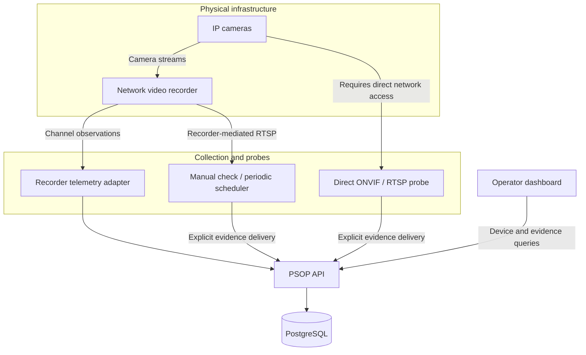

<div align="center">

# PSOP
### Physical Security Observability Platform

**Operational evidence for cameras, recorders, and the infrastructure behind them.**

Understand what was observed, where the observation came from, and whether it is still current.

**Active development · Hardware-backed lab validation · Experimental periodic scheduler**

[Capabilities](#capabilities-and-maturity) · [Architecture](#architecture) · [Getting started](#getting-started) · [Documentation](#documentation) · [Roadmap](#roadmap)

</div>

---

## Overview

PSOP is an operational observability platform for physical security infrastructure. It brings device telemetry, recorder channel observations, and bounded stream measurements into an evidence-based view of system operation.

The project starts with cameras and network video recorders. Its longer-term direction is a vendor-neutral platform for heterogeneous physical infrastructure, with explicit provenance, asset relationships, and incident analysis. Current hardware validation is narrower than that vision and is documented below.

PSOP is intended to help security integrators and operations teams answer a practical question:

> **What evidence do we have that this part of the security system is working—and how recent is that evidence?**

It complements video management and recording workflows by making operational observations inspectable. The current stream checks do not store video or verify recordings.

## The problem

A camera or recorder can respond on the network without providing usable video. A successful stream session can receive no video packets. A previously successful measurement can become too old to describe the current situation.

Treating these conditions as a single “online” indicator conceals the difference between device connectivity and the function an operator depends on.

PSOP separates them:

| Operational question | Evidence examined |
| --- | --- |
| Can the collector reach the device? | Connectivity observations |
| What does the recorder report about a camera channel? | Recorder-reported channel observations |
| Can a stream session be established? | RTSP negotiation outcome |
| Did video packets arrive during the check? | Selected video RTP packet count and measurement window |
| Who observed this, and through which path? | Observer identity, target binding, source, and access method |
| Is the observation still current? | Observation time, expiration, and derived freshness |
| Did the full attempt reach the API? | Completeness of the expected evidence rows |

### An operational example

A recorder remains reachable, but a check of one channel negotiates RTSP successfully and then receives no video packets within the measurement window.

PSOP can preserve the successful negotiation while reporting the unsuccessful media observation. The stream panel keeps that result separate from connectivity and identifies the recorder-mediated access path. When the evidence expires, its original result remains available with an expired state.

This is the distinction the product is built around: **connectivity, observed function, and freshness each carry their own meaning.**

## Capabilities and maturity

“Implemented” describes code present in the repository. “Lab validated” describes a specific hardware observation; it does not imply general manufacturer compatibility or production readiness.

| Capability | Current implementation | Validation boundary |
| --- | --- | --- |
| Operational evidence ledger | API ingestion and PostgreSQL persistence | Automated contract and service coverage; real stream evidence delivered to the API |
| Device details and stream panel | Provenance, stage outcomes, packet measurements, freshness, and completeness | Web integration implemented; selected states checked with simulated responses |
| NVR-mediated RTSP check | Explicit recorder/channel binding and bounded video RTP measurement | Real checks succeeded on three Hikvision channels through a Speco N8NRL |
| Direct-camera ONVIF/RTSP probe | Discovery, identity checks, profile selection, and stream measurement | Synthetic coverage; direct-camera hardware validation remains pending |
| Speco watcher recovery | Handles supported reachability, relogin, and API-delivery failure scenarios | Recovery tests and real telemetry operation in the lab |
| Periodic stream scheduler | Multiple configured recorders/targets, concurrency limits, backoff, suspension, and bounded queue | Automated coverage and a successful one-channel real `--once --send` run; sustained operation remains pending |

The direct-camera probe currently checks for a Hikvision manufacturer and a pinned serial hash. The scheduler currently exposes the `NVR_RTSP_MANUAL_URI` integration. Broader vendor support is a development direction, not a compatibility claim.

## Evidence model

### Stream stages

| Stage | Meaning in the current implementation | Important boundary |
| --- | --- | --- |
| E4 — Stream URI obtained | An endpoint was obtained through the discovery path | An operator-supplied recorder URI does not produce E4 |
| E5 — RTSP session negotiated | DESCRIBE, SETUP, and PLAY completed successfully in the checked session | Negotiation alone does not establish receipt of video |
| E6 — Media received | Selected video RTP packets arrived during the bounded check | The current probe measures packets, not decoded frames |

The existing E6 contract identifier is `E6_FRAMES_RECEIVED`. Current probe output explicitly identifies the actual measurement as `RTP_VIDEO_PACKETS` and reports `decodedFrames=NOT_MEASURED`.

### Provenance and completeness

NVR-mediated observations declare `access=NVR_MEDIATED` and an operator-supplied URI source. The recorder serves the stream; this does not independently verify the physical camera's identity.

Each mediated attempt groups its E5 and E6 rows under one `attemptId`. Each row has its own source event identifier. Delivery retries preserve the original identifiers, body, and timestamps so a retry does not create fresh evidence from an old observation.

If only part of the attempt reaches the ledger, the API and dashboard expose an incomplete measurement rather than presenting the available successful stage as overall success.

### Measurement states

| State | Operator interpretation |
| --- | --- |
| `NO_MEASUREMENT` | No stream measurement is available |
| `SUCCEEDED` | The latest complete attempt succeeded and remains within its validity window |
| `FAILED` | The latest complete attempt reports a failed or unsupported stage |
| `INCOMPLETE` | Only part of the latest expected NVR-mediated attempt reached the ledger |
| `EXPIRED` | The validity window ended; the original outcome and completeness remain visible |

Expiration does not establish a new equipment failure. Periodic sampling also leaves time between checks in which the stream has not been observed.

## Architecture

The diagram shows the implemented observation and evidence paths at a component level. It is not a production deployment topology.



| Component | Stack | Responsibility |
| --- | --- | --- |
| Dashboard | React, TypeScript, Vite | Device inspection and operational evidence presentation |
| API | NestJS, TypeScript | Device operations, authenticated ingestion, and evidence queries |
| Persistence | PostgreSQL, Prisma | Device data and operational evidence ledger |
| Gateways and probes | Python | Device communication, stream checks, and experimental scheduling |
| Workspace | pnpm, Turborepo | Dependency management and development tasks |

Stream evidence ingestion is separate from core heartbeat and connectivity updates. Running a stream check does not, by itself, update device connectivity or establish recording health.

## Getting started

### Prerequisites

- **Node.js 22.x** and **pnpm 11.15.0**, as declared by the workspace.
- **Python 3** for gateways, probes, and their tests.
- **Docker** for the documented local PostgreSQL environment.
- Application environment configuration, database setup, and authorized device credentials for hardware checks.

The local lab manager currently targets the project's macOS development environment and uses macOS Keychain for the Speco watcher password. The scheduler uses Unix file locking. Neither should be assumed to be a cross-platform production service installer.

### Install dependencies

The current implementation is on the development branch:

```bash
git clone --branch feat/operational-observability-foundation https://github.com/paulobiao/psop.git
cd psop
pnpm install --frozen-lockfile
```

Dependency installation alone does not provision the database, create credentials, or configure the hardware integrations. Follow the [gateway guide](apps/gateway/README.md) and [lab runtime guide](docs/LAB_RUNTIME.md) before starting a new environment.

### Start an already configured lab

```bash
pnpm run lab:start
pnpm run lab:status
```

| Service | Local development endpoint |
| --- | --- |
| Dashboard | `http://127.0.0.1:5173` |
| API health | `http://127.0.0.1:3100/api/v1/health` |

Use `pnpm run lab:stop` to stop managed application and gateway processes. The lab manager intentionally leaves the shared PostgreSQL container running.

The Speco watcher can run from a dedicated clean worktree while configuration stays in the development workspace. Publishing new code does not automatically update or restart that selected runtime.

### Validate a scheduler configuration

Use the [example configuration](apps/gateway/stream-scheduler.example.json) and [scheduler instructions](apps/gateway/STREAM_PROBE.md#periodic-executor-stream_schedulerpy) to prepare an ignored local configuration with explicit target bindings and credential references.

```bash
python3 apps/gateway/stream_scheduler.py \
  --config apps/gateway/stream-scheduler.local.json --validate
```

`--validate` checks configuration and references without contacting equipment or delivering evidence. It does not prove credentials or stream availability. Network checks and evidence delivery are separate actions documented in the probe guide.

## Verification

Run the combined development checks from the repository root:

```bash
pnpm run check
```

This runs Prisma validation/generation, gateway tests, API unit tests, API compilation, dashboard type checking, and the dashboard build. It requires the applicable local development environment.

| Scope | Command |
| --- | --- |
| Python gateways and probes | `pnpm run test:gateway` |
| API unit tests | `pnpm test` |
| API compilation | `pnpm --filter api build` |
| Dashboard type check | `pnpm --filter dashboard typecheck` |
| Dashboard build | `pnpm --filter dashboard build` |
| Scheduler regression tests | `python3 -m unittest discover -s apps/gateway/tests -p 'test_stream_scheduler.py' -v` |

Integration tests are separate from `pnpm run check`. Review [the integration runner](scripts/test-security-integration.sh) and its environment requirements before running `pnpm run test:integration`.

Automated fixtures cover protocol responses, authentication outcomes, channel binding, partial delivery, retry behavior, suspension, and shutdown. They complement hardware checks; they do not replace them.

## Hardware validation and operating limits

The current lab includes a **Speco N8NRL** and **three connected Hikvision cameras**. Real recorder-mediated checks have demonstrated successful RTSP negotiation and video RTP reception on all three channels. Real API delivery and a scheduler one-shot run have also succeeded for one channel.

The lab recorder has no installed HDD, so these observations do not establish recording or retrieval functionality.

Important current boundaries:

- **Network topology:** cameras on a recorder's private PoE network may be inaccessible to a direct-camera probe. The recorder-mediated path explicitly represents that different access method.
- **Stream interpretation:** packet reception does not establish decoded image quality, scene visibility, recording continuity, or playback availability.
- **Scheduler maturity:** longer running periodic operation and multi-recorder hardware validation remain pending. Real authentication-related suspension still needs investigation; the tested stale-nonce renewal does not establish that the lab incident is resolved.
- **Delivery durability:** the scheduler's pending queue is bounded and memory-based. It is not durable across process termination.
- **Supervision:** the scheduler is a foreground process. Production service supervision, reboot recovery, and deployment-scale performance remain future work.

## Configuration and security boundaries

The stream ingestion path authenticates the observer and checks the target's tenant/site and recorder assignment. Recorder-mediated evidence is also checked against the recorder-reported channel mapping.

Probe credential handling supports documented external references and hidden prompts. The current ONVIF/RTSP probe implementation supports Digest challenges and refuses Basic-only authentication. TLS paths use certificate verification; support for a protocol is not a guarantee of compatibility with every device configuration.

Keep the following private and outside version control:

- Device passwords, ingestion keys, and authenticated stream URLs.
- Local device mappings and real probe/scheduler configuration.
- Machine-specific runtime state and configuration.

Stream evidence uses sanitized metadata rather than raw discovery responses, SDP, session headers, or media files. Review outputs before sharing them: operational identifiers and deployment details may still be sensitive.

## Repository map

| Path | Contents |
| --- | --- |
| [`apps/api/`](apps/api/) | NestJS application, Prisma schema, API tests |
| [`apps/dashboard/`](apps/dashboard/) | React operator interface |
| [`apps/gateway/`](apps/gateway/) | Python integrations, stream probes, scheduler, and tests |
| [`docs/`](docs/) | Evidence contracts and operating documentation |
| [`infra/`](infra/) | Infrastructure configuration |
| [`scripts/`](scripts/) | Lab management and verification tooling |

## Roadmap

| Milestone | Intended outcome |
| --- | --- |
| Sustained stream assurance | Repeated-cycle validation, authentication diagnostics, recovery behavior, and multi-recorder exercises |
| Asset intelligence | Central asset management with declared versus observed identity, provenance, and verification timestamps |
| Operational topology | Inspectable physical and logical dependencies linked to asset details |
| Incident analysis | Use dependency and observation history to improve operational investigation |
| Integration expansion | Additional documented vendor adapters and verified access paths |
| Deployment readiness | Durable delivery strategy, service supervision, installation guidance, and operational benchmarks |

These are planned milestones, not delivery commitments or current feature guarantees.

## Documentation

| Guide | What to read it for |
| --- | --- |
| [Gateway guide](apps/gateway/README.md) | Integration setup and gateway operation |
| [Stream probes and scheduler](apps/gateway/STREAM_PROBE.md) | Direct and recorder-mediated checks, configuration, and validation procedures |
| [Video assurance foundation](docs/VIDEO_ASSURANCE_FOUNDATION.md) | Evidence semantics and ingestion contract |
| [Lab runtime](docs/LAB_RUNTIME.md) | Separation of runtime code and local configuration |
| [Speco delivery recovery](docs/SPECO_DELIVERY_RECOVERY.md) | API outage handling and isolated recovery tests |

## Project stewardship

Developed by [Paulo Biao](https://github.com/paulobiao) as part of the BiaoTech project portfolio.

For reproducible bugs or technical proposals, use the [repository issues](https://github.com/paulobiao/psop/issues). Include the affected component, version or commit, expected behavior, and sanitized reproduction steps. Describe whether a reported result came from a fixture, a real device, or an operator declaration.

**License:** workspace package metadata currently differs. A repository-wide licensing policy remains to be clarified; no unified license grant is asserted by this README.
